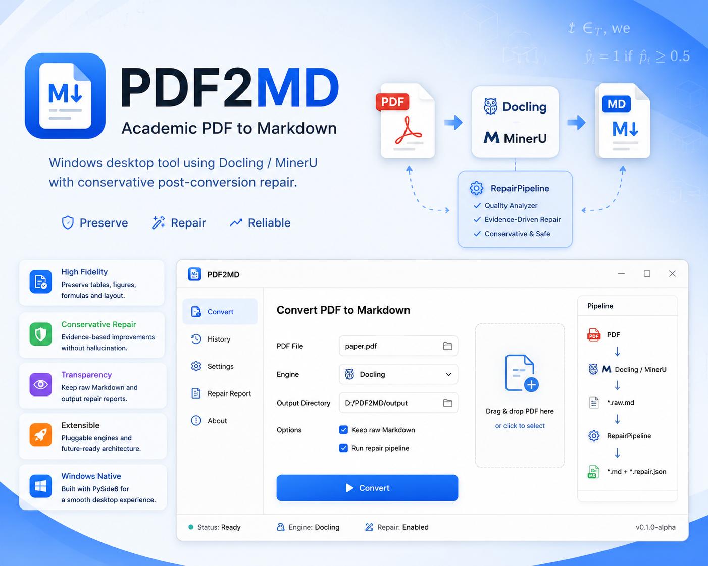
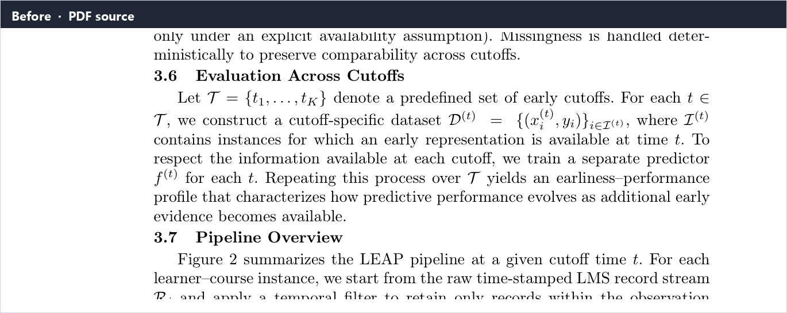
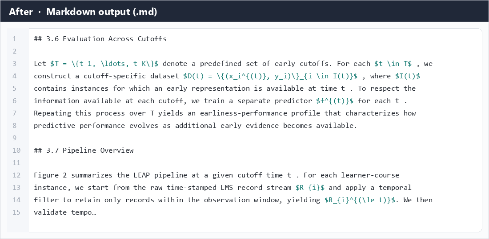

# PDF2MD



Windows desktop app for **academic PDF → Markdown**. It offers two complementary workflows:

1. **快速自动 (Structured)** — Lean Docling parse + local **DeepSeek-OCR-2** formula recovery
2. **高保真视觉 (Vision fidelity)** — page rendering + **DeepSeek web vision** transcription for layout-faithful output

> **Status: Alpha (v0.1.0-alpha).**  
> Treat all outputs as drafts. Formula-heavy or vision runs still need spot-checks.

License: **Apache-2.0** — see [`LICENSE`](LICENSE) and [`NOTICE`](NOTICE).

中文说明：[README.zh-CN.md](README.zh-CN.md)

---

## Screenshots

Same academic excerpt — **PDF before** vs **Markdown after** (structured workflow).

**Before · PDF**



**After · Markdown**



---

## Choose a workflow

| | **快速自动** (default) | **高保真视觉** |
|---|---|---|
| **Goal** | Fast, structured Markdown with repair | Pixel-faithful transcription of every page |
| **Engine** | Docling / MinerU | DeepSeek **web** vision mode (Playwright) |
| **Formulas** | Local DeepSeek-OCR-2 Worker (optional) | Model reads page images; LaTeX in transcript |
| **Figures** | AssetPipeline naming + export | Vision transcript + Docling auto-crop for `FIGURE` slots |
| **Output dir** | `output/<paper>/` | `output/<paper>_高保真/` |
| **Typical time** | Seconds (no broken formulas) | Minutes–hours (batch size 10, browser-bound) |
| **Best for** | Most papers, batch conversion | Hard layouts, strict fidelity, equation/table preservation |

The two paths are **independent**. Vision mode does **not** use the local OCR daemon.

The same window also accepts **EPUB**: spine order → one Markdown file. It does not use Docling, formula OCR, or vision mode, and DRM-encrypted books fail with a clear error.

---

## What structured mode does today

| Area | Behavior |
|------|----------|
| Parse | **Docling** lean path (formula enrich OFF, tables FAST, pictures ×3) |
| Engines | Docling (default) / MinerU / Auto |
| Figures | **AssetPipeline**: `image_{N}_{stem}.png`, optional `manifest.json` |
| Formulas | Detect broken / `formula-not-decoded` → DeepSeek formula-crop OCR |
| Identity | Bind printed Eq.(n) **before** OCR (PDF label / defining prose) |
| Writeback | High-confidence only; multiline `$$` + optional `\tag{n}` |
| Worker | **GUI-independent daemon** on `127.0.0.1:18765` (survives GUI restart) |
| Repair | Unicode, table/`$` safety, mandatory blank line between tables and images |

Typical wall times on a warm machine (illustrative):

- No broken formulas → **~4–11 s**
- ~7 formulas recovered → **~60–70 s**
- Cold DeepSeek load (first time) → can add **~3–4 min** once per session

---

## What vision fidelity mode does today

| Area | Behavior |
|------|----------|
| Render | PDF pages → labeled PNGs (scale follows **图片质量**, default **2×**, `bookfigures/`) |
| Transcribe | Batches of **10 pages** → DeepSeek vision chat (Playwright, headed browser) |
| Prompt | Strict no-summary rules; multiline `$$`; `\tag{n}` only when printed on page |
| Browser automation | DOM fill/upload/send, template matching (L2), recorded workflow replay |
| Resilience | Level-0–4 recovery (re-copy, page retry, sub-batch, full re-submit) |
| Rate limits | Detects attachment **「服务器繁忙」** (DOM + image template); **~10 min** account cooldown |
| Validation | Page markers, truncation guard, formula integrity, content preservation |
| Merge | Batch merge + Markdown cleanup (table↔figure spacing, display math fences) |
| Figures | Docling auto-extract into `FIGURE` placeholders after merge |
| State | `.vision/manifest.json` + per-batch dirs; resumable after interrupt |

**Browser modes**

- **Playwright auto** (recommended): isolated subprocess, persistent profile in `data/deepseek_profile/`
- **Clipboard semi-auto**: manual paste when automation is unavailable

**UI calibration**: toolbar **DeepSeek UI…** or `scripts/calibrate_deepseek_ui.py` for screenshot templates (`data/deepseek_templates/`).

---

## Architecture

### Structured (Lean Balanced)

```text
PDF
  → Docling (lean: no formula enrich)
  → *.raw.md + images
  → AssetPipeline
  → RepairPipeline
       → FormulaPipeline
            → bbox + Equation Identity
            → DeepSeek Worker OCR ×1 / formula
            → Gate (strong context conflict = hard veto)
            → Controlled writeback ($$\n...\n$$  \tag{n}?)
  → *.md + *.formula_qa.json + timings_*.json
```

### Vision fidelity

```text
PDF
  → render_pdf_to_bookfigures (scale from 图片质量, default 2×, page labels)
  → VisionPipeline (per batch)
       → Playwright: new chat → vision mode → prompt + upload
       → wait response → capture / copy markdown
       → validate (page markers, quality, formula integrity)
       → recovery planner on failure
  → merge_accepted_batches + clean_vision_markdown
  → Docling figure auto-extract → final *.md
```

**Shared export rules** (enforced in code):

- Blank line between table rows and `` links
- Display math as multiline `$$` fences (Typora / MathJax safe)
- Main UI: high-frequency options only; diagnostics behind **…**

---

## Requirements

- Windows 10/11 (primary target)
- Python **3.10+** (3.12 tested)
- **Structured + formulas**: NVIDIA GPU strongly recommended for DeepSeek-OCR-2
- **Vision mode**: `playwright` + Chromium; logged-in DeepSeek account in browser profile
- Install engines separately: `docling`, optional `mineru`, CUDA `torch` matching your driver

---

## Quick start

```bash
python -m venv .venv
.venv\Scripts\activate
pip install -r requirements.txt
pip install docling
python run_gui.py
```

Or double-click `run_gui.bat` (launches `pythonw`, no console window). The `input/` folder is **optional** — you do not need to copy files there.

### Vision fidelity (Playwright)

```bash
pip install playwright
playwright install chromium
```

First run: log in to DeepSeek in the opened browser window. Profile is reused from `data/deepseek_profile/`.

### DeepSeek formula recovery — structured mode (optional)

```bat
set PDF2MD_HF_HOME=D:\path\to\hf-cache
set PDF2MD_DEEPSEEK_MODEL_DIR=D:\path\to\DeepSeek-OCR-2
set PDF2MD_DSOCR2_PYTHON=D:\path\to\dsocr2\Scripts\python.exe
```

Keep the Worker warm across GUI restarts:

```bash
python scripts/start_deepseek_ocr_daemon.py --warmup
```

China mirror: if `HF_ENDPOINT` is unset, the GUI **defaults** to `https://hf-mirror.com`. Override in `.env` with `HF_ENDPOINT=https://huggingface.co` to use the official Hub.

Optional MinerU model source:

```bat
set MINERU_MODEL_SOURCE=modelscope
```

See [`.env.example`](.env.example).

---

## Usage

1. Start the app (`run_gui.py` or `run_gui.bat`)
2. Pick **快速自动** or **高保真视觉** at the top
3. Drag PDF / EPUB from **any folder** onto the drop zone **or the task table** — no need to copy into `input/`
4. Leave the export folder as the project **`output/`** (one subfolder per book). Do not point it at a Desktop `PDFTomd` tree
5. Click **开始转换**. Finished tasks are not re-run automatically. Interrupted jobs resume from the last saved page
6. **Structured**: enable formula recovery when needed; the page column shows `128/392` while running. Review `*.md` and `*.formula_qa.json`
7. **Vision**: Playwright or clipboard mode; output goes to `*_高保真/`; watch the pipeline panel. Do not close the DeepSeek browser
8. You can **multi-select** rows (checkboxes, or Ctrl / Shift click). **删除选中** removes every checked item. **开始转换** still runs every pending item in the queue
9. The task table lists past jobs by time (newest on top); newly added files go to the top. Use **继续** to resume
10. **删除选中** moves checked rows to the recycle bin (button on the task table). **清空列表** does the same for every row. Output files are not deleted
11. Right-click **重试** to convert from page 1. Vision: **仅重合并与裁图** skips the browser

**Vision tips**

- On **服务器繁忙** (server busy on uploads), the app pauses ~10 minutes per account and resumes automatically
- **强制重跑浏览器转录** clears prior vision batches

---

## Project layout

```text
PDF2MD/
├── app/
│   ├── engines/              # Docling / MinerU / EPUB
│   ├── epub/                 # EPUB unpack / chapter HTML→MD
│   ├── assets/               # Figure naming / manifest
│   ├── repair/               # RepairPipeline + PDF geometry
│   ├── formula/              # Detection, identity, gate, writeback
│   ├── ocr/                  # DeepSeek-OCR-2 Worker client
│   ├── vision_transcribe/    # Vision fidelity pipeline + Playwright browser
│   ├── workers/              # QThread workers (structured + vision)
│   ├── task_history.py       # Local history + recycle bin (loaded into the main table on startup)
│   ├── dialogs/ / ui/        # GUI, settings, MoreOptionsDialog
│   └── main_window.py
├── data/                     # Login profile, UI templates, task history (local)
├── input/                    # Optional; drag from anywhere instead
├── output/                   # Default export root
├── scripts/                  # daemon, calibration, benchmarks, publish helpers
├── tests/
├── docs/images/
├── debug/formula_benchmark/  # Formula recovery fixtures & canary
├── run_gui.py
├── run_gui.bat               # pythonw, no console
└── requirements.txt
```

---

## Configuration

| Item | Notes |
|------|--------|
| Export dir | Default: project `output/` (main window) |
| Image quality | Prefer **High (×3)** for papers with figures |
| Formulas + DeepSeek | Structured workflow only |
| Parallel jobs | Prefer `1` on 8 GB VRAM |
| Vision batch size | Default 10 pages (`VisionConfig.batch_size`) |
| Server-busy cooldown | Default 600 s (`VisionConfig.server_busy_cooldown_seconds`) |

| Variable | Purpose |
|----------|---------|
| `PDF2MD_PYTHON` | Python for subprocess tooling |
| `PDF2MD_DOCLING_ARTIFACTS` | Docling artifacts directory |
| `PDF2MD_HF_HOME` | HF / transformer cache root |
| `PDF2MD_DEEPSEEK_MODEL_DIR` | Local DeepSeek-OCR-2 snapshot |
| `PDF2MD_DSOCR2_PYTHON` | Interpreter that can load DeepSeek-OCR-2 |
| `DEEPSEEK_WORKER_IDLE_UNLOAD_SECONDS` | Idle unload model (default 3600) |
| `PDF2MD_BENCH_PDF` / `PDF2MD_BENCH_ROOT` | Local benchmark PDFs for scripts |
| `HF_ENDPOINT` | Hugging Face mirror. GUI **defaults** to hf-mirror.com; override in `.env` |
| `MINERU_MODEL_SOURCE` | MinerU model source (optional `modelscope`) |

---

## Development

```bash
pip install -r requirements.txt
pip install -e ".[dev]"
python -m compileall -q app tests
pytest
```

CI (`.github/workflows/ci.yml`): `compileall` + `pytest` on Windows × Python 3.10–3.12.  
Does **not** download Docling / DeepSeek weights or run Playwright against live DeepSeek.

After task-table or help-dialog changes, run `pytest tests/test_ui_layout_smoke.py`.

**Useful scripts**

| Script | Purpose |
|--------|---------|
| `scripts/start_deepseek_ocr_daemon.py` | Formula Worker daemon |
| `scripts/calibrate_deepseek_ui.py` | Recalibrate vision UI templates |
| `scripts/record_deepseek_dom.py` | Record DOM replay steps |
| `scripts/smoke_deepseek_load.py` | GPU load smoke test |

---

## Roadmap

- Stronger formula canary yield on hard documents (O-003 / O-024 / O-028 class)
- Vision: smarter batch sizing and ETA
- Optional Windows login Task Scheduler warmup for the OCR daemon
- Broader table structure repair from PDF geometry

Frozen for now: DeepSeek OCR prompt/token budget, Lean Docling picture×3, coverage-first mandatory OCR round.

---

## Contributing / security

[`CONTRIBUTING.md`](CONTRIBUTING.md) · [`SECURITY.md`](SECURITY.md)

---

## Disclaimer

- Converts documents you provide locally.
- You are responsible for copyright / privacy of your PDFs.
- Vision mode uses the DeepSeek **website** under your account; respect their terms of use.
- OCR / layout / formula accuracy varies; review before publishing.
- Third-party engines and models have their own licenses (see [`NOTICE`](NOTICE)).
